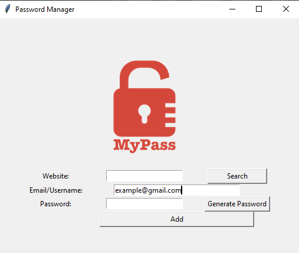

# Password-Manager-App
Password manager/generator app, written in Python.
It has the ability to save, generate and search passwords.
The GUI is created using tkinter library

## How To Use The App:
This app present you with the leverage to write your password and the username or Email to any website and save this data to a file called data.json.

   - Use the Generate Password-Button to auto-generate a very strong password.
   - To save the data just click on the Add-Button and then confirm the detail, then it will save.
   - You can search for previously saved info, by entering the site name, then click on the Search-button, it will give you the detail if it's in the database.
    
    
## The App Looks:

Be safe!

